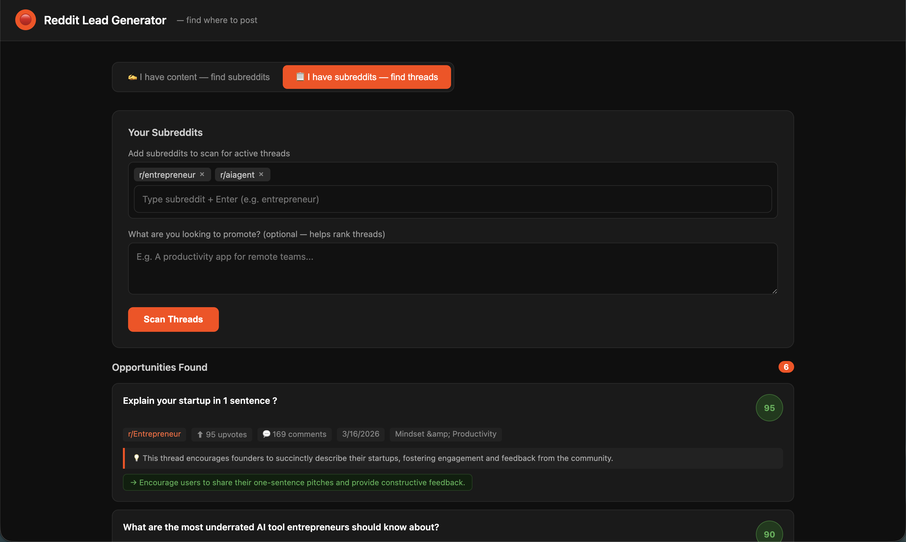

# Reddit Lead Generator

Find the best Reddit threads to engage with — powered by OpenAI, Claude, or Ollama.

Paste your content and let AI identify the exact subreddits and active threads where you can organically promote your product, project, or service. No Reddit API credentials required.


---

## How it works

Two modes, one goal — find where to post on Reddit.

**Mode 1 — I have content, find me subreddits**
Paste your post or product description. The AI suggests 8–12 relevant subreddits, fetches their hot threads, then scores each thread (0–100) with a reason and suggested action.

**Mode 2 — I have subreddits, find me threads**
Add your own subreddits. Optionally describe what you're promoting. The AI fetches hot threads and ranks them by engagement opportunity.

All Reddit data is fetched from Reddit's public `.json` API — no OAuth, no API keys, no rate-limit headaches.

---

## Features

- **Multi-provider AI** — works with OpenAI, Anthropic Claude, or a local Ollama model. Auto-detects what's available and lets you switch in one click.
- **No Reddit credentials** — uses Reddit's public JSON endpoints (`reddit.com/r/{sub}/hot.json`).
- **Thread scoring** — every result comes with a 0–100 relevance score, a reason, and a suggested action (reply / comment / post).
- **Subreddit discovery** — in content mode, AI recommends subreddits you may not have thought of.
- **Dark UI** — clean, fast single-page interface.

---

## Screenshots



---

## Getting started

### Prerequisites

- [Node.js](https://nodejs.org/) 18+
- At least one of:
  - An [OpenAI API key](https://platform.openai.com/api-keys)
  - An [Anthropic API key](https://console.anthropic.com/)
  - [Ollama](https://ollama.com/) running locally

### Installation

```bash
git clone https://github.com/your-username/reddit-lead-generator.git
cd reddit-lead-generator
npm install
```

### Configuration

Copy the example env file and fill in your keys:

```bash
cp .env.example .env
```

```env
# .env

# At least one AI provider is required

OPENAI_API_KEY=sk-...
# OPENAI_MODEL=gpt-4o-mini          # default

# ANTHROPIC_API_KEY=sk-ant-...
# CLAUDE_MODEL=claude-haiku-4-5-20251001   # default

# OLLAMA_BASE_URL=http://localhost:11434    # default
# OLLAMA_MODEL=llama3                      # default

PORT=3000
```

You only need to set the keys for providers you want to use. The app auto-detects which ones are available on startup.

### Run

```bash
# Production
npm start

# Development (auto-restarts on file changes)
npm run dev
```

Open [http://localhost:3000](http://localhost:3000).

---

## AI provider setup

### OpenAI

Set `OPENAI_API_KEY` in your `.env`. Uses `gpt-4o-mini` by default — fast and cheap. Override with `OPENAI_MODEL=gpt-4o` for better results.

### Claude (Anthropic)

Set `ANTHROPIC_API_KEY` in your `.env`. Uses `claude-haiku-4-5-20251001` by default. For higher quality, set `CLAUDE_MODEL=claude-sonnet-4-6`.

### Ollama (local, free)

1. [Install Ollama](https://ollama.com/download)
2. Pull a model:
   ```bash
   ollama pull llama3
   ```
3. Make sure Ollama is running (`ollama serve`) — no key needed.

The app pings `localhost:11434` on load. If Ollama responds, it shows up as an available provider automatically.

---

## API reference

The backend exposes three endpoints.

### `GET /api/providers`

Returns which AI providers are currently configured and available.

```json
{
  "available": ["openai", "claude"]
}
```

---

### `POST /api/find-threads`

Given post content, suggests subreddits and returns ranked threads.

**Request body**

| Field | Type | Required | Description |
|---|---|---|---|
| `content` | string | Yes | Your post, product description, or idea |
| `configured_subreddits` | string[] | No | Extra subreddits to always include |
| `provider` | string | No | `"openai"`, `"claude"`, or `"ollama"`. Falls back to first available. |

**Response**

```json
{
  "provider": "openai",
  "subreddits": ["entrepreneur", "startups", "SideProject"],
  "results": [
    {
      "title": "Ask HN: What tools do you use for API cost tracking?",
      "url": "https://reddit.com/r/...",
      "subreddit": "webdev",
      "score": 88,
      "comments": 142,
      "created": "3/17/2026",
      "reason": "Direct question about the problem your tool solves",
      "action": "Reply with your tool and a brief demo link"
    }
  ]
}
```

---

### `POST /api/subreddit-threads`

Fetches and ranks threads from a given list of subreddits.

**Request body**

| Field | Type | Required | Description |
|---|---|---|---|
| `subreddits` | string[] | Yes | Subreddit names (with or without `r/`) |
| `context` | string | No | What you want to promote — improves ranking |
| `provider` | string | No | AI provider override |

**Response** — same shape as above, without `subreddits`.

---

## Project structure

```
reddit-lead-generator/
├── server.js          # Express backend + AI provider abstraction
├── public/
│   └── index.html     # Single-page frontend
├── .env               # Your API keys (never commit this)
├── .env.example       # Safe to commit
├── .gitignore
└── package.json
```

---

## Contributing

Contributions are welcome. A few ideas if you want to help:

- Add more Reddit sorting modes (new, rising, top)
- Export results to CSV
- Save and reload subreddit configurations
- Add a "generate reply" feature using AI
- Support more Ollama models in the UI picker

To contribute:

1. Fork the repo
2. Create a branch (`git checkout -b feature/my-feature`)
3. Commit your changes
4. Open a pull request

---

## License

MIT — do whatever you want with it.

---

## Disclaimer

This tool is intended for organic, helpful engagement on Reddit. Please follow Reddit's [content policy](https://www.redditinc.com/policies/content-policy) and each subreddit's rules. Spamming or self-promoting without contributing value will get you banned. Use this to find the *right* conversations to genuinely participate in — not to blast links everywhere.
